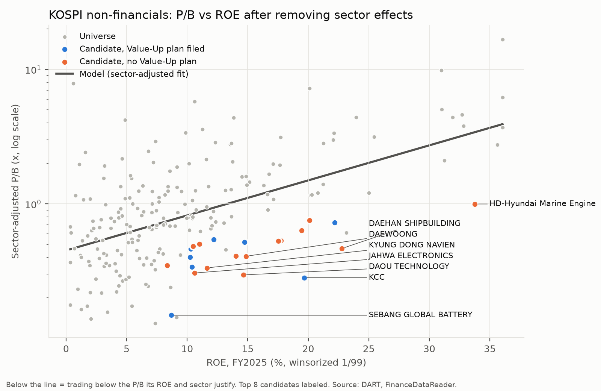
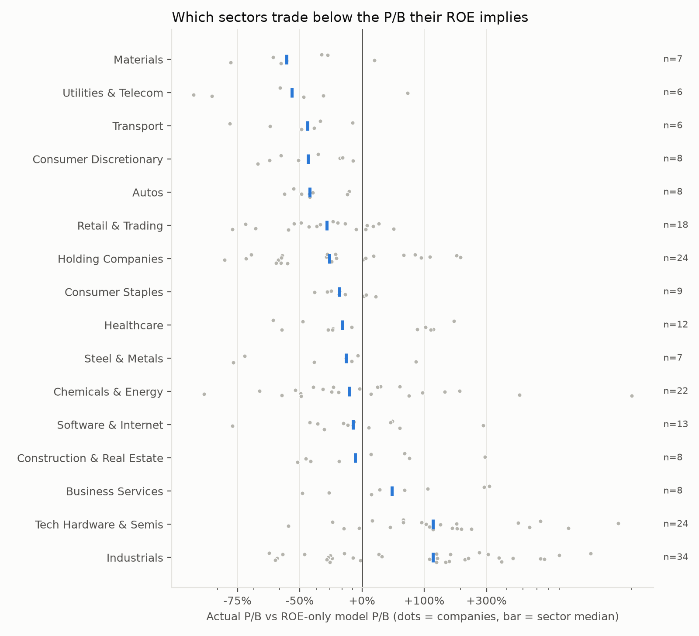
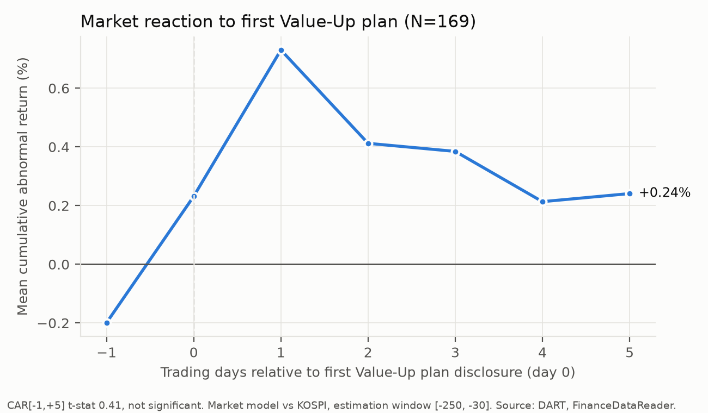

# Korea Value-Up Re-rating Screen

Which KOSPI companies still trade below the P/B their ROE justifies, after Korea's governance
reforms (the Value-Up Program from February 2024, Commercial Act amendments from July 2025 and
the dividend tax changes of January 2026)?

This repo screens the KOSPI with public data, tests how the market reacted to Value-Up plan
disclosures, and values one screen candidate, Kyung Dong Navien (009450 KS), in a sell-side
style initiation note backed by an Excel model with live formulas.

## Deliverables

| Deliverable | File |
|---|---|
| Initiation note (4 pages) | [note/Navien_initiation.pdf](note/Navien_initiation.pdf) |
| Excel model: 3 statements, DCF, sensitivities, trading comps | [model/Navien_009450_model.xlsx](model/Navien_009450_model.xlsx) |
| Valuation assumptions with sources | [model/assumptions.md](model/assumptions.md) |
| Screen results and candidate list | [outputs/candidates.csv](outputs/candidates.csv), [data/processed/screen_results.csv](data/processed/screen_results.csv) |
| Screen and event study write-up | [outputs/phase1_3_summary.md](outputs/phase1_3_summary.md) |
| Data quality report | [outputs/data_quality_report.md](outputs/data_quality_report.md) |

## Key findings

**Market screen**
- **ROE explains about half of valuation.** Across 214 KOSPI non-financials, log(P/B) on ROE
  with sector fixed effects gives R-squared 0.53. One extra point of ROE goes with about 6%
  higher P/B within a sector.
- **The discount is concentrated, not universal.** 32% of companies trade below a textbook
  justified P/B at a 9.2% cost of equity. Materials, utilities and telecom, transport and autos
  trade 45% to 57% below the P/B their ROE implies. Holding companies sit about 30% below.
- **Filing a Value-Up plan did not move prices.** Across 169 first plan disclosures, the mean
  7-day cumulative abnormal return is +0.24% (t = 0.41). No subgroup is significant.

**Kyung Dong Navien: Overweight, target price KRW 83,000 (37.9% upside from KRW 60,200)**
- The FY2025 earnings decline was tax, not operations: operating profit rose 8% while the
  effective tax rate jumped to 40.5% on a deferred tax swing.
- A two-year capex cycle (KRW 104.3bn plant expansion) ended in July 2026. Modeled free cash
  flow to the firm is KRW 62bn to 90bn a year from FY2027E, after negative free cash flow in FY2025.
- Payout is 12% against a 25% screen median and no Value-Up plan has been filed. Since filings
  alone did not move prices, the catalyst is an actual payout increase.
- The DCF (WACC 7.9%, terminal growth 2.0%) sits below every comparables-based value, because it
  does not extrapolate 1H2026 margins that include undisclosed US tariff refunds.







## Method

| Step | Script | What it does |
|---|---|---|
| Universe | `src/build_universe.py` | KOSPI common stocks, excluding REITs and infrastructure funds, market cap of at least KRW 500bn, positive EPS and BPS, KRW reporters only. Pulls FY2025 financials, dividends and Value-Up filings from DART. |
| Screen | `src/screen.py` | OLS of log(P/B) on winsorized ROE with sector fixed effects and HC3 robust SEs. The residual is the discount to ROE-justified P/B. Cross-checked against justified P/B = (ROE - g) / (COE - g). |
| Event study | `src/event_study.py` | Market-model CAR over [-1, +5] around each company's first Value-Up plan, estimated on [-250, -30] against KOSPI. |
| Model | `src/build_model.py` | Writes the Excel model. Historical figures are read from cached DART files, all projections and valuation outputs are formulas. |
| Check | `src/evaluate_model.py` | Evaluates all 1,122 formula cells, fails on any error, and exports labeled results. The DCF was also recomputed independently in Python and matches to within KRW 1 per share. |
| Note | `src/build_note.py` | Builds the note from the evaluated model and screen outputs, so every number traces to the pipeline. |

Screen definitions:
- P/B = (common + preferred market cap) / parent equity
- ROE = parent net income / parent equity (FY2025)
- Payout = DPS / EPS, both from the DART dividend table

Valuation choices worth knowing:
- **Bottom-up beta.** Navien's regression beta against KOSPI is 0.13 with R-squared 0.01, because
  the index is dominated by semiconductors. The model uses Damodaran's Building Materials
  unlevered beta (0.86), relevered at Navien's debt to equity.
- **Normalized tax.** 29.9%, the FY2024 to FY2025 average of tax at statutory rates, excluding
  the deferred tax swings that made reported rates 18.6% and 40.5%.
- **Conservative margin.** 9.5% from FY2027E, the FY2023 to FY2025 average, because the 1H2026
  tariff refund that lifted margins to 18.2% is not quantified in any filing.

## Data sources

- [DART OpenAPI](https://opendart.fss.or.kr) via OpenDartReader: financial statements, notes,
  dividends, exchange disclosures, industry codes
- FinanceDataReader: KOSPI listing, market cap, daily prices, KOSPI index
- FRED series IRLTLT01KRM156N: Korea 10-year government bond yield
- Damodaran Online, January 2026: country risk premiums, global industry betas, synthetic ratings
- Yahoo Finance via yfinance: peer market data for trading comparables

## Reproduce

Requires Python 3.12, a free DART API key and (for the PDF) Google Chrome.

```bash
python -m venv .venv
.venv/bin/pip install -r requirements.txt
cp .env.example .env   # then add your DART_API_KEY
.venv/bin/python src/build_universe.py
.venv/bin/python src/screen.py
.venv/bin/python src/event_study.py
.venv/bin/python src/build_model.py
.venv/bin/python src/evaluate_model.py
.venv/bin/python src/build_note.py
```

Run the scripts from the repo root. Raw API responses are cached in `data/raw/` (not committed),
so reruns do not call the APIs again.

## Limitations

- One fiscal year of ROE in the screen. Cyclical companies at peak earnings can look cheap.
- Treasury shares are included in screen market caps, which slightly overstates P/B for
  companies holding large treasury positions.
- Event study first-plan dates cluster (59 in March 2026), which overstates the precision of the
  t-statistic.
- The Navien model uses a simplified balance sheet: debt and other net assets are held flat and
  cash is the plug. Minority interests in Commax are ignored in the income statement.
- Terminal value is 78% of enterprise value, so the target is sensitive to WACC and long-term
  margin. Both sensitivities are in the model and the note.
- Peer multiples come from Yahoo Finance and were not reconciled to each peer's filings.

This is an independent student project, not investment advice.
